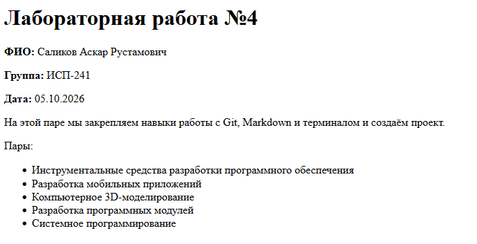
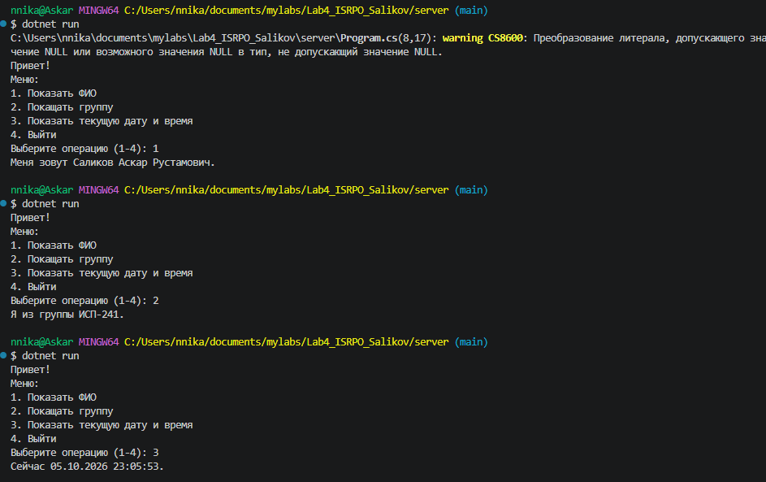
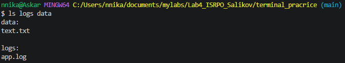
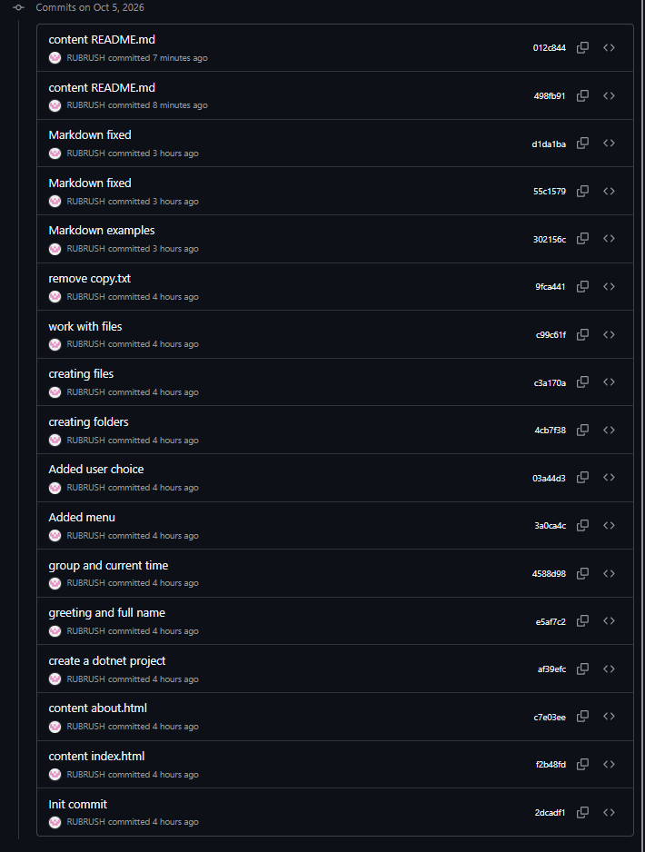

# Лабораторная работа №4. Закрепление навыков работы с Git, Markdown, терминалом и проектной структурой

* **ФИО:** Саликов Аскар Рустамович
* **Группа:** ИСП-241
* **Дата:** 05.10.2026

---

### Содержание
1. [Описание проекта](#описание-проекта)
2. [Структура проекта](#структура-проекта)
3. [Примеры разметки Markdown](#примеры-разметки-markdown)
4. [Математические формулы (LaTeX)](#математические-формулы-latex)
5. [Ссылка на репозиторий](#ссылка-на-репозиторий)
6. [Результаты выполнения (Скриншоты)](#результаты-выполнения-скриншоты)
7. [Заключение](#заключение)

---

### Описание проекта
Данный проект направлен на закрепление ключевых навыков использования Git, консоли и Markdown:
* Создание и управление проектной структурой исключительно с помощью команд терминала.
* Освоение системы контроля версий Git.
* Верстка базовых веб-страниц на HTML.
* Создание и запуск консольного приложения на C#.
* Оформление документации с использованием синтаксиса **Markdown** и математических формул **LaTeX**.

---

### Структура проекта

* client/
    1. about.html
    2. index.html
* docs/
    1. markdown_examples.md
* repo/
    1. скриншоты
* server/
    1. консольный dotnet-проект
* terminal_pracrice/
    * data/
        1. text.txt
    * logs/
        1. app.log
        2. ~~copy.txt~~ (удалён)
* **README.md**

---

### Примеры разметки Markdown

#### Пример подзаголовка четвёртого уровня

#### Маркированный список:
* Разделение проекта на frontend и backend
* Отработка команд терминала: `mkdir`, `touch`, `cp`, `mv`, `rm`
* Написание формул в разметке LaTeX

#### Пример кода:
```csharp
using System;

namespace ServerApp
{
    class Program
    {
        static void Main(string[] args)
        {
            Console.WriteLine("Лабораторная работа №4");
            Console.WriteLine("ФИО: Саликов Аскар Рустамович");
            Console.WriteLine("Группа: ИСП-241");
        }
    }
}
```
#### Пример изображения:


---

## Математические формулы (LaTeX)

* Inline-формула (эквивалентность массы и энергии): $E = mc^2$

* Block-формула (корни квадратного уравнения через дискриминант):

$$
x_{1,2} = \frac{-b \pm \sqrt{b^2 - 4ac}}{2a}
$$

---

## Ссылка на репозиторий
Исходный код и история коммитов доступны по [ссылке](https://github.com/xekk829-web/Lab4_ISRPO_Salikov)

---

### Результаты выполнения (Скриншоты)

#### 1. Открытая страница index.html


#### 2. Работа консольного приложения в терминале


#### 3. Структура с папками и практика работы


#### 4. История коммитов в GitHub


---

### Заключение
В процессе выполнения лабораторной работы были достигнуты следующие результаты:
1. Отработаны навыки работы с терминалом.
2. Реализовано интерактивное консольное меню на языке C#.
3. Созданы и оформлены HTML-страницы проекта.
4. Освоено оформление документации проектов с использованием Markdown и LaTeX.